# Material failure prototype
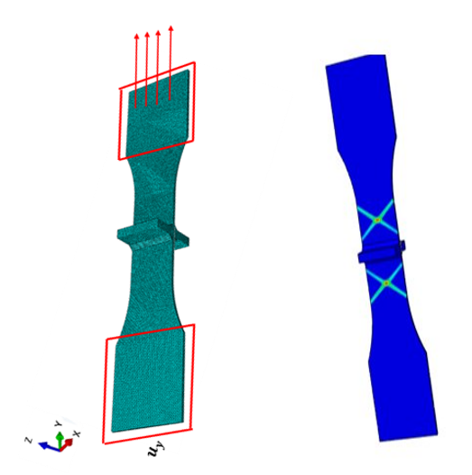

Monotonic & Fatigue
We are using mechanical testing data produced in the laboratory by means of a test frame on which we grip a material specimen. The material could be anything (metal, polymer etc.). The test frame could be of any type. A requirement for the test frame is that it can provide to us force and displacement over time. For the monotonic tests, the displacement is the controllable parameter (e.g., 1mm/min). The load is the uncontrollable parameter (i.e. it is not known a priori) but it is measurable by the system (i.e. a load cell), and it’s the opposite for the fatigue tests.
Therefore, in lack of prior knowledge if a random material is tested, a user will not know in general when failure will occur. This applies for any type of loading e.g. monotonic tension/compression or cyclic or anything else.

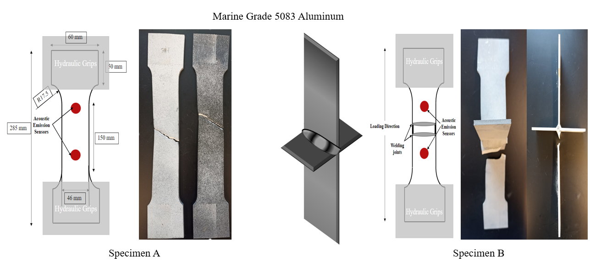

Mechanical Testing coupled with AE and DIC
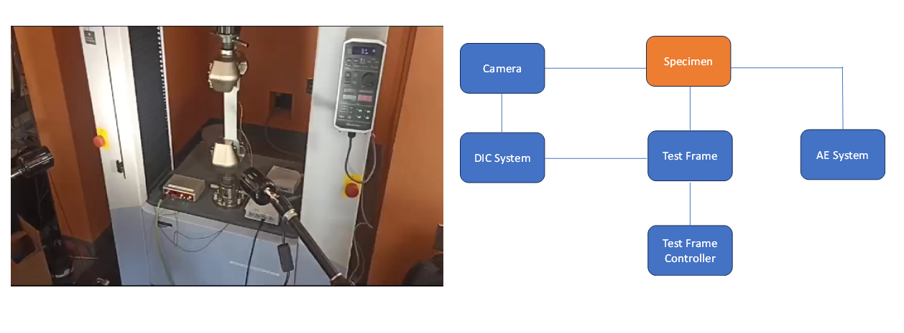

data collection
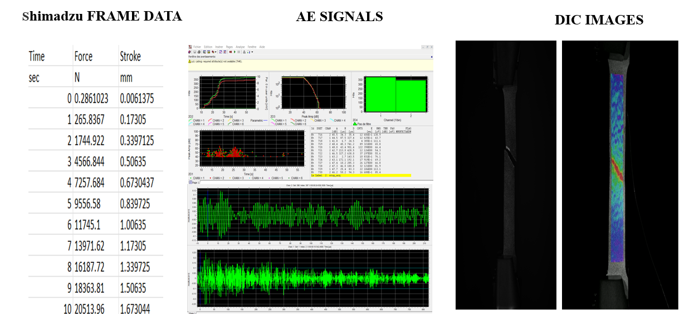

data synchronization
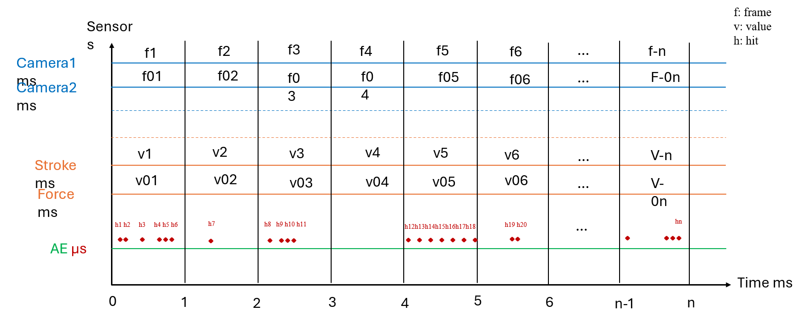
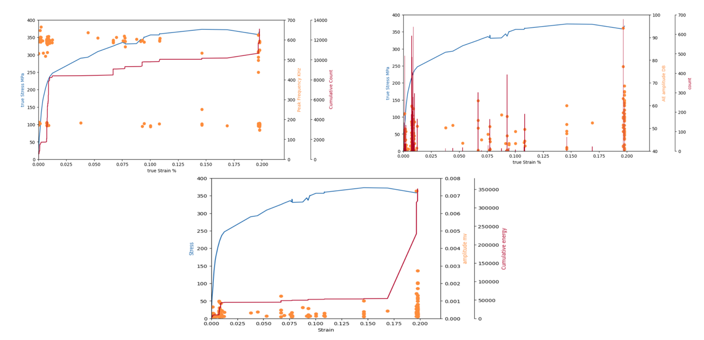
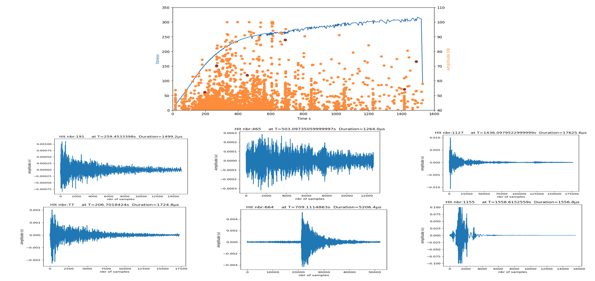
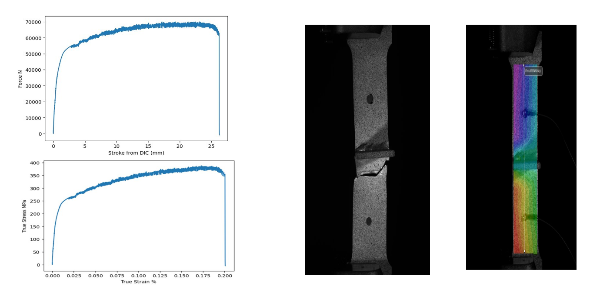

Mahalanobis distance is a measure of how far a point is from the mean of a multivariate distribution, normalized by the covariance matrix of the distribution. It is calculated as the square root of the product of the difference vector, the inverse covariance matrix, and the transpose of the difference vector. Mahalanobis distance takes into account the scale, correlation, and shape of the variables, and it is invariant to linear transformations. It is especially useful for detecting outliers, because it measures how many standard deviations a point is from the mean along each principal component. 

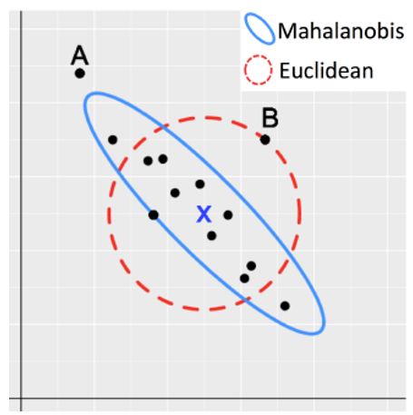
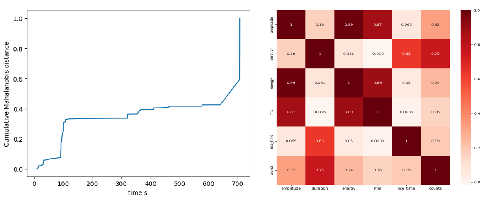
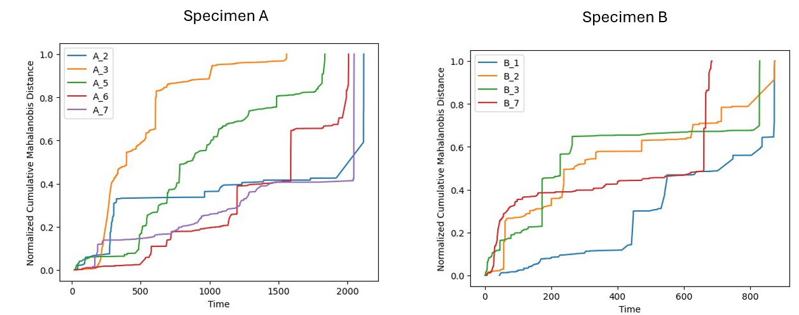

Real time data collection from DIC
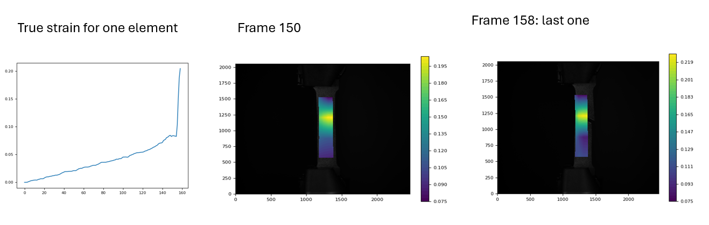

In this test we used 16 element ( we can change it if we change the mesh) and 3724 images. The table include the True strain, the displacement and the coordinates (in pixels) for 1 element through all the frames. And the picture include a plot for the strain.

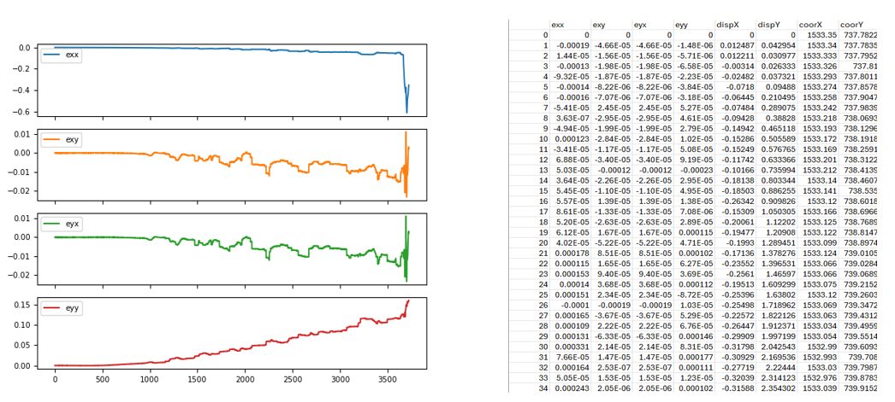
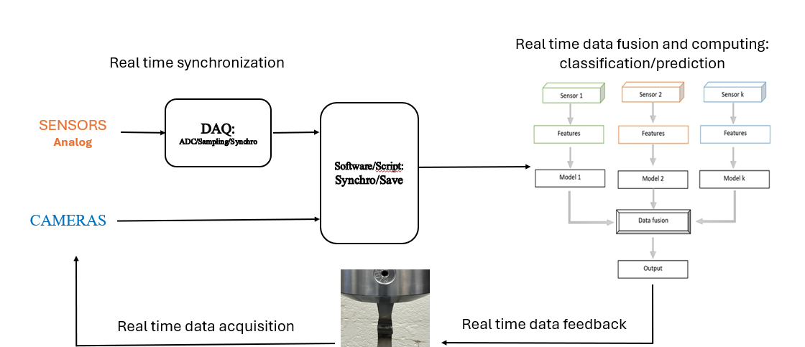

# AI Methods for Material Failure prediction
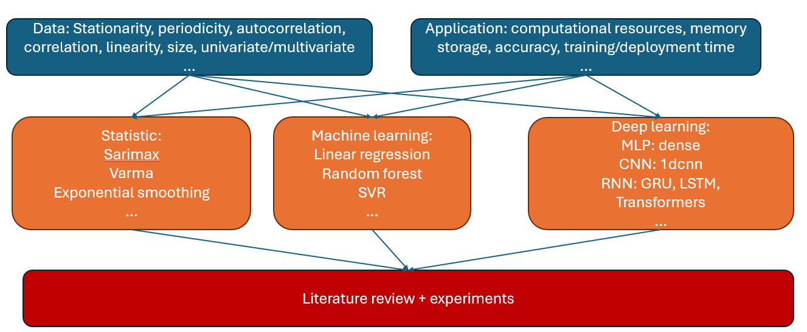

## Monotonic
Parameter prediction
In parameter prediction method, the RUL estimation is based on the prediction of parameter values before the threshold is achieved. This approach is also called the degradation model approach, in which there are two main laws of degradation:
Linear degradation: the prediction is presented as a straight line while historical data determine its slope; it is usually applied if the system does not accumulate damage (degradation).
Exponential degradation: the prediction is presented as an exponent; it is usually applied if the system can accumulate damage cumulatively.
In this case, there are two options:

1. to predict sensor signals,
2. to predict health indicator.

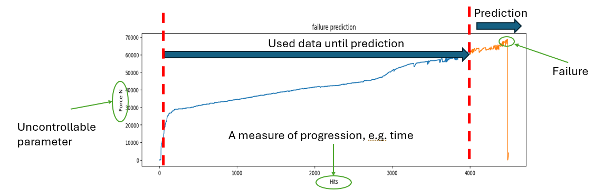

Data splitting

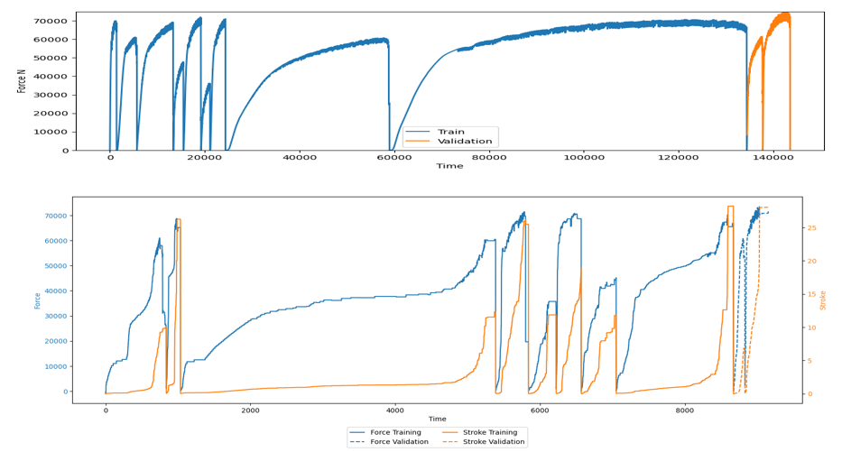

Data Labeling: univariate
LSTM input (Batch size [to compute the loss], Window Length [past steps for training]: X, number of features [sensors for examples])
LSTM output (number of prediction steps in the future: Y)

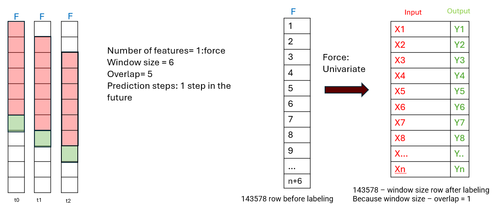

Data Labeling: multivariate
LSTM input (Batch size [to compute the loss], Window Length [past steps for training]: X, number of features [sensors for examples])
LSTM output (number of prediction steps in the future: Y)

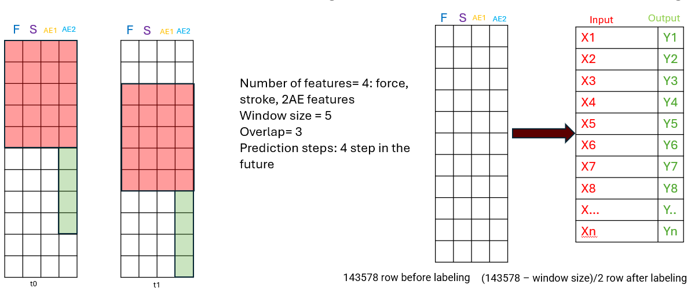

Data normalization for real time deployment

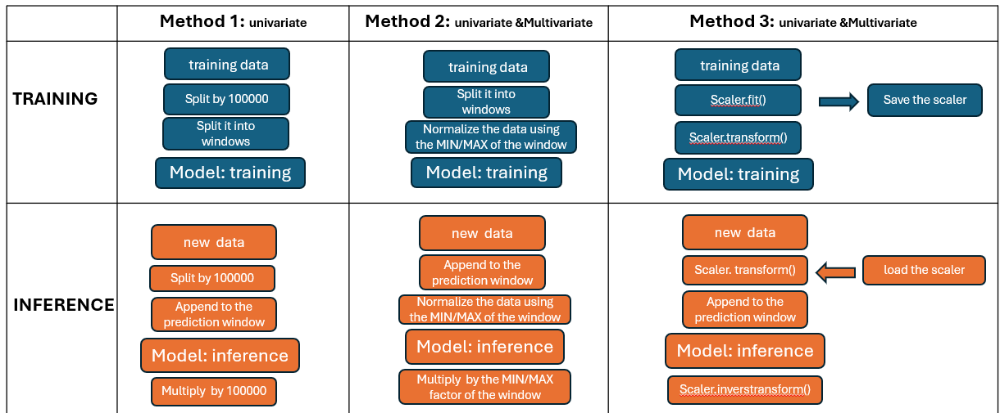
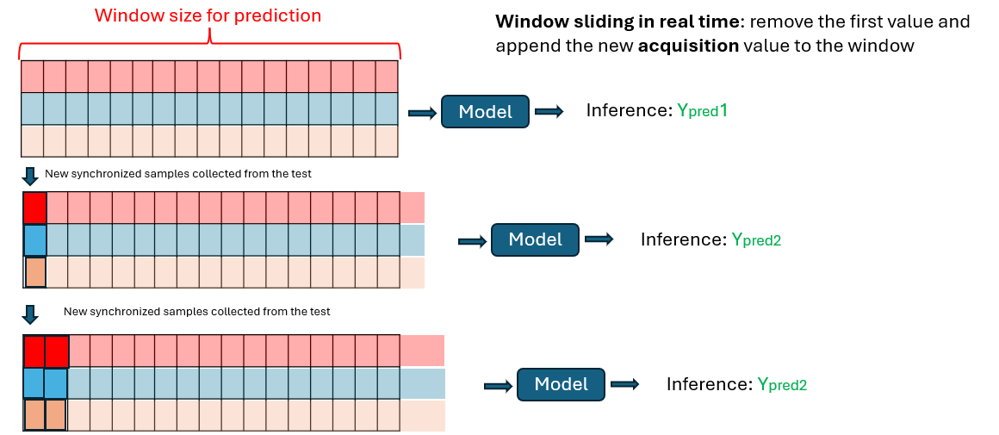
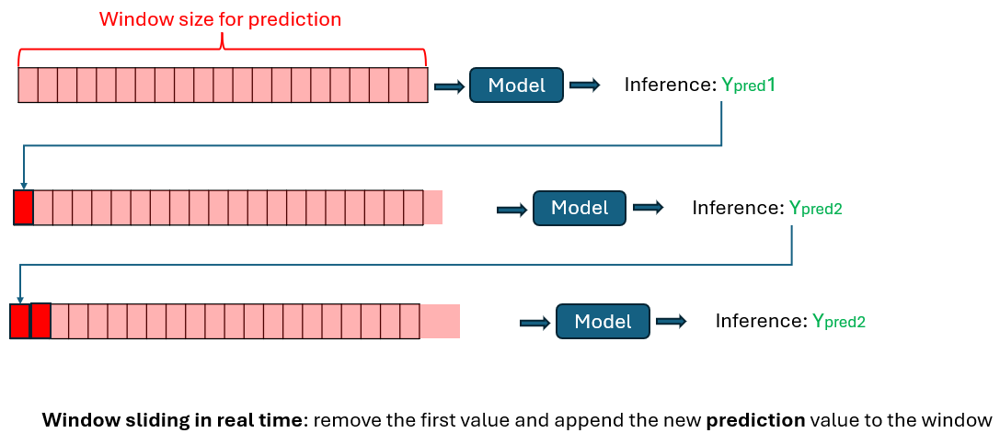

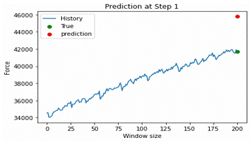
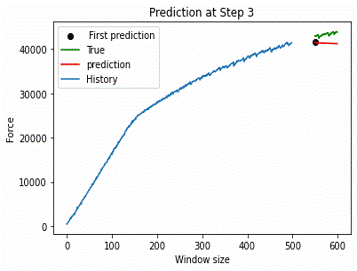

# Fatigue
Similarity with patterns from previous periods
Another very common approach to RUL estimation, also known as the similarity model, is comparing current operation or condition with historical data. To do that, we can cut previous periods in operation at the same moment in time as the current period
There are two main options to implement the similarity model:

Direct comparison of time series using proximity metrics 
Selection of features from a time series and further comparison of the obtained feature vectors (i.e., proximity metrics, clustering).

The desired RUL estimation will be the value of the most similar operation period from the history or the average (or any other aggregation) over a group / cluster of operation periods

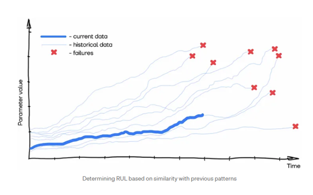

Feature extraction, data cleaning and RUL normalization
Assign a cycle for each hit using time. 
Assign a RUL  for each hit that we know now the total number of cycles
Normalize the RUL values between 0 and1
Count the number of hits for each normalized RUL
Extra: keep only the hits with max amplitude > 45db
Extra: keep the hits with count >…..
Extra: keep the hits with count/duration >…..

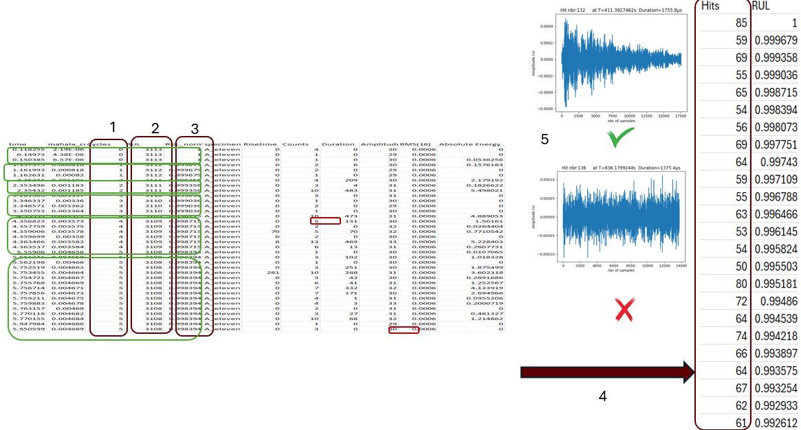

Model:
3 Lstm layers 128, 50,0 50 neurons
3 dropout layers 0.2 
1 dense layer with 1 neuron
Hyperparametrs:
Optimizer: adam
batch_size=50
10 epochs

Mean Absolute Error: 0.12126805577578029 
Mean Squared Error: 0.02203677116764039

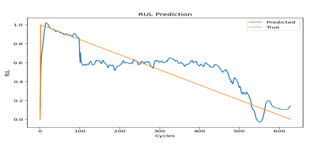

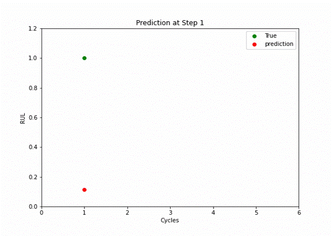
